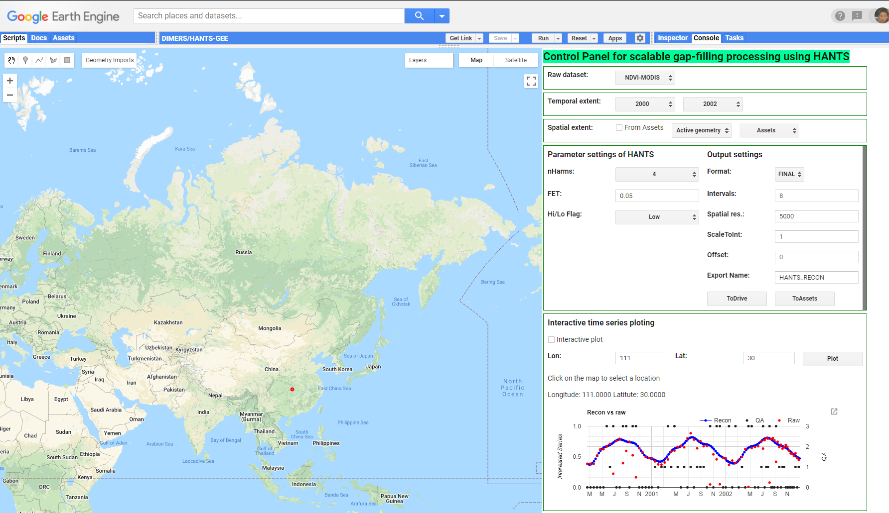

====
HANTS-GEE
====
This repository aims to archieve the documents for `HANTS-GEE <https://code.earthengine.google.com/7b30903af9632265e8f1703554897420>`_ (Latest update: 18/3/2023), a scalable implimentation of HANTS for time sereis reconstruction in remote sensing on Google Earth Engine platform.

/**********************************************************************

The Harmonic ANalysis of Time Series (HANTS) was proposed by Verheof (1996) and Menenti et al. (1993)
to reconstruct time series of remote sensing products such as NDVI and LAI.
The algorithm had been widely used in the remote sensing community and implemented 
in Fortran, IDL/ENVI, Matlab, C, and Python.   
The script in this file aim to implement the HANTS in GEE, which can avoid 
donwloading large volume dataset to local PC and also make full use of the 
powerfull computation resource of GEE.

Main features:
 - HANTS kernel 
 - Long-term (multiple years) processing for pre-defined area. Each year is
   processed seperately with half of an year overlap.
 - processing result can be export to google drive as well as Assets for 
   further analysis.
 - TO speed up the exporting and downloading, one can choose to export final 
   harmonic coefficient and then construct final image series in local PC. 

  
  *Figure 1. Grapical User Interface  for HANTS-GEE*

.. figure:: figures/sample_case1.png
  :width: 800
  :alt: A reconstrction case with HANTS-GEE
  :class: with-border
  
  *Figure 2. Pixel-level time series reconstruciton with HANTS-GEE. Gray dots represent quality assessment (QA) value for observation (MODIS-NDVI: 0- Good Data, 1- Marginal Data, 2- Snow/Ice, 3- Cloudy. Red squres indicate observations identified as valid by HANTS-GEE and other observations were outliers.*

Attentions:
 - If you want to export the result for large area with high spatial reolution 
   and long-time series, better to seperate the region in different parts and 
   export it one by one. Otherwise, it will take a long time to processing or 
   even failed.
 - The maixum storage space provide by Google Drive with free account is 15 GB,
   please check your left space before exporting result.
   
Author: Dr. Jie Zhou

Email: zhou.j@ccnu.edu.cn

Central China Normal University, Wuhan, P.R. China

*************************************************************************/

Usage of the packages

The manuscript on this package is under review, the source code of the package will be avaliable here after the manuscript get published.

Usefull reference

[1]	Menenti, M, S Azzali, W Verhoef, and R Van Swol. 1993. “Mapping Agroecological Zones and Time Lag in Vegetation Growth by Means of Fourier Analysis of Time Series of NDVI Images.” Advances in Space Research 13 (5). Elsevier: 233–237.

[2]	Roerink, GJ, Massimo Menenti, and Wout Verhoef. 2000. “Reconstructing Cloudfree NDVI Composites Using Fourier Analysis of Time Series.” International Journal of Remote Sensing 21 (9). Taylor & Francis: 1911–1917.

[3]	Verhoef, W. 1996. Application of Harmonic Analysis of NDVI Time Series (HANTS). Fourier Analysis of Temporal NDVI in the Southern African and American Continents. DLO Winand Staring Centre, Wageningen, TheNetherlands.

[4]	Zhou, Jie, Li Jia, and Massimo Menenti. 2015. “Reconstruction of Global MODIS NDVI Time Series: Performance of Harmonic ANalysis of Time Series (HANTS).” Remote Sensing of Environment 163. Elsevier: 217–228.

[5]	Zhou, Jie, Li Jia, Massimo Menenti, and Xuan Liu. 2021. “Optimal Estimate of Global Biome—Specific Parameter Settings to Reconstruct NDVI Time Series with the Harmonic ANalysis of Time Series (HANTS) Method.” Remote Sensing 13 (21). Multidisciplinary Digital Publishing Institute: 4251.

[6]	Zhou Jie, Massimo Menenti, Li Jia, et al. 2023. “A scalable software package for time series reconstruction of remote sensing datasets on the Google Earth Engine platform”. International Journal of Digital Earth. Accepted.
